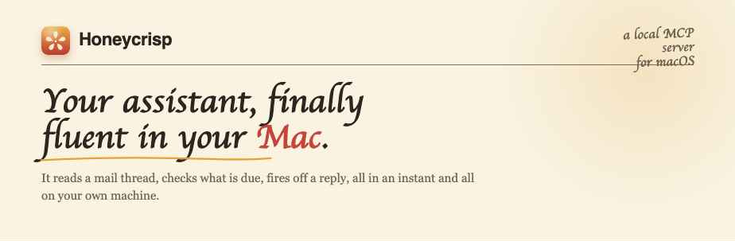

<!-- Honeycrisp README. The assets/ folder is committed alongside this file (see bottom note). -->

<p align="center">
  <picture>
    <source media="(prefers-color-scheme: dark)" srcset="assets/banner/letter-dark.png">
    
  </picture>
</p>

<p align="center">
  
  
  
  
  
</p>

<p align="center">
  <a href="#install">Install</a> &nbsp;&middot;&nbsp;
  <a href="#connect-your-assistant">Connect your assistant</a> &nbsp;&middot;&nbsp;
  <a href="#how-it-works-and-why-it-is-private">How it works</a> &nbsp;&middot;&nbsp;
  <a href="#contributing-and-requesting-apps">Contributing</a>
</p>

<p align="center">
  A local MCP server for macOS that gives the AI you already use fast, private, native access to Mail, Reminders, Calendar, Messages, and Contacts.
</p>

---

Honeycrisp lets the AI assistant you already use read a mail thread, check what is due today, fire off a quick reply, or pull up a contact, all in an instant and all on your own machine. It talks straight to the system frameworks your Apple apps already use, so the answers come back fast and the data comes back real.

It works with any client that speaks the Model Context Protocol, the same way that client uses any other server. You keep your assistant. Honeycrisp just teaches it your Mac.

## The short version

- **It is fast and native.** It speaks to the system frameworks the apps already use, so requests come back right away with real, structured data instead of scraped text.
- **It is completely private.** Everything stays on your Mac. Nothing is uploaded, ever, and the only record kept is a local activity list you can clear. Your assistant only sees the one thing you ask for, the moment you ask for it.
- **It works with any assistant.** Any MCP client can use it, so you are not locked into a single app or vendor.

## What it can reach today

Honeycrisp speaks to five of the apps I live in every day. Each one is a real, first-class connection rather than a thin wrapper. This list is going to grow, so the table is the easy part to extend.

| App | What your assistant can do |
| --- | --- |
|  **Mail** | Pull the thread you half remember, summarize it, draft a reply that sounds like you, and mark it read when you are done. |
|  **Reminders** | Check what is due today, capture the thing you just thought of, and tick items off in the conversation. |
|  **Calendar** | See what is on today, look ahead at the week, and put new events on the books. |
|  **Messages** | Catch up on the threads you missed and send a reply without reaching for your phone. |
|  **Contacts** | Look someone up, fix a misspelled name, or save a new face the moment it comes up. |

> [!TIP]
> If there is an app you wish your assistant could reach, [open an issue](https://github.com/christianpatrick/honeycrisp/issues/new) and tell me which one. I am keeping a list.

## Install

Honeycrisp is a small menu bar app with a bundled `honeycrisp` command line bridge. The easiest way to get it will be Homebrew.

```sh
brew install christianpatrick/tap/honeycrisp
```

You will also be able to download a signed build from the [releases page](https://github.com/christianpatrick/honeycrisp/releases) and drop it in your Applications folder.

> [!NOTE]
> Honeycrisp requires macOS 15 or later. The Homebrew tap and the releases page are not live yet, so until the first release ships you build from source: clone the repo, run `swift scripts/package-app.swift`, and drag `dist/Honeycrisp.app` into Applications. The `honeycrisp` command ships inside the app at `Contents/MacOS/honeycrisp-cli`, and the app's setup screen hands you a config snippet with that path filled in.

## Connect your assistant

Honeycrisp works with any MCP client. You point the client at the `honeycrisp serve` command and it does the rest. Here is the most common setup.

### Claude Desktop

Add Honeycrisp to your client config, then restart the app.

```jsonc
// ~/Library/Application Support/Claude/claude_desktop_config.json
{
  "mcpServers": {
    "honeycrisp": {
      "command": "honeycrisp",
      "args": ["serve"]
    }
  }
}
```

### Any other MCP client

Every other client follows the same shape. Register a server, set the command to `honeycrisp`, and pass `serve` as the argument. If your client lists servers in a UI, add one pointing at the Honeycrisp binary.

Clients that speak HTTP can skip the bridge and talk to the menu bar app directly:

```sh
claude mcp add --transport http honeycrisp http://127.0.0.1:41117/mcp
```

Either way, every request flows through the one app you granted access to, shows up in its activity list, and obeys the permissions you set in the panel.

## Configuration

By default Honeycrisp exposes all four apps in read and write mode. You can narrow that down with flags on the `serve` command or in a small config file.

| Option | Default | What it does |
| --- | --- | --- |
| `--apps` | `all` | Comma separated list of apps to enable, for example `mail,reminders`. |
| `--read-only` | `false` | Lets your assistant read but never send, reply, or change anything. |
| `--port` | `stdio` | Serve over a local port instead of standard input and output. |

The first time your assistant touches an app, macOS asks you to grant access to that app, the same prompt you would see for any other software. You stay in control of every permission.

## How it works, and why it is private

Most tools like this drive your apps with AppleScript, spinning up a process and parsing loose text for every request. Honeycrisp speaks to the system frameworks directly instead, so the same request that used to crawl now comes back in a blink, with nothing brittle left to break.

> **Everything stays on your Mac.** Nothing is uploaded, ever. The only record Honeycrisp keeps is the activity list you can open from the menu bar, it lives on your Mac, and you can clear it whenever you like.

There is no account, no cloud, and no telemetry. If your Mac is offline, Honeycrisp still works, because the only machine involved is the one in front of you.

## Why I built this

I am Christian. I lead an engineering team by day and build small tools I wish existed by night, usually from the couch. I built Honeycrisp because I was tired of waiting, `[the specific moment your assistant stalled on something simple on your Mac]`.

I kept at it because I wanted my Mac to feel native and quick again, and because I wanted my own data to stay mine. It is still early, and I am adding to it with care. I hope it earns a small place on your machine.

## Contributing and requesting apps

Honeycrisp is early and growing. The most useful thing you can do is tell me which app you want next, so if there is one you are missing, [open an issue](https://github.com/christianpatrick/honeycrisp/issues/new) and describe how you would use it. If you would rather build it yourself, pull requests are genuinely welcome, and the app integrations are designed to be added one at a time.

Please read the [contributing guide](CONTRIBUTING.md) before you start, and be kind in the issue tracker. This is a small project made with care, and I would like it to stay that way.

## License

Honeycrisp is free and open source under the [MIT license](LICENSE). Use it, fork it, and build on it.

<p align="center">
  <sub>Made with care by Christian.</sub>
</p>

<!--
  Assets this README expects (committed alongside the file):
    assets/banner/letter-light.png     hero banner, light theme
    assets/banner/letter-dark.png      hero banner, dark theme
    assets/app-icons/mail.svg
    assets/app-icons/reminders.svg
    assets/app-icons/messages.svg
    assets/app-icons/contacts.svg

  Prefer a different banner? assets/banner/ also has:
    gradient-light/dark.png   the honey-to-red blush poster
    minimal-light/dark.png    the understated icon + wordmark mark
  Swap the two srcset/src paths in the <picture> block at the top.

  Placeholders left to fill before the first public release: the Homebrew
  tap, and the one personal sentence in "Why I built this".
-->
